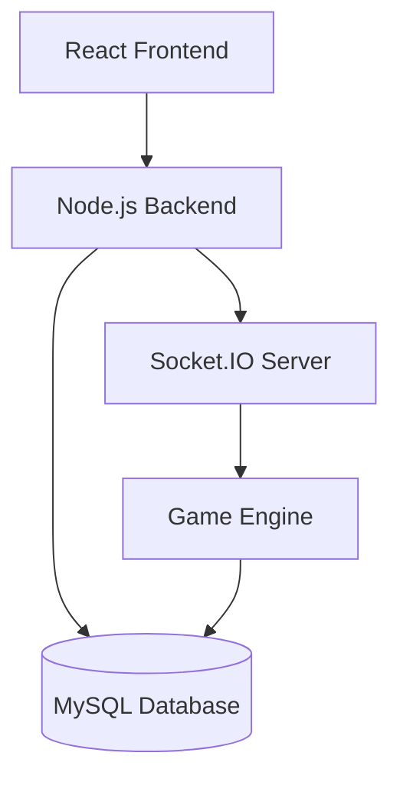

# Architecture Documentation

This directory contains architectural documentation for the Spotted Game application.

## System Architecture

### High-Level Architecture


### Component Overview
1. **Frontend (React.js)**
   - TypeScript-based UI components
   - Mantine UI Framework
   - Socket.IO Client for real-time updates
   - State management with React hooks
   - Mobile-responsive design

2. **Backend (Node.js)**
   - Express REST API
   - Socket.IO for real-time communication
   - Game logic and scoring system
   - Authentication with bcrypt
   - MySQL database integration

3. **Database (MySQL)**
   - User authentication data
   - Chat message history
   - Game statistics and scores

## Directory Structure
```
spotted-game/
├── frontend/          # React.js frontend application
│   ├── src/           # Source code
│   │   ├── components/# UI components
│   │   ├── pages/     # Page components
│   │   └── assets/    # Images and other static assets
├── backend/           # Node.js backend server
│   ├── server.js      # Main entry point
│   └── game/          # Game logic
├── docs/              # Documentation
└── docker-compose.yml # Container orchestration
```

## Key Architecture Features

### Real-time Communication
- Socket.IO for bidirectional communication
- Event-based architecture for game state updates
- Chat messaging system

### Game Engine
- Flag position randomization
- Difficulty-based rendering
- Coordinate normalization
- Proximity-based scoring calculations
- Game cycle management

### Mobile Support
- Responsive design patterns
- Touch input detection
- Adaptive UI components

### Deployment
- Docker containerization
- Render.com cloud hosting
- Nginx for serving static files and API proxying 