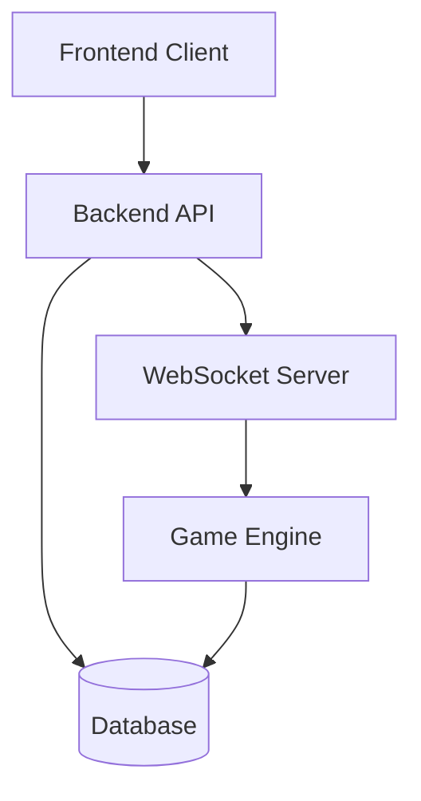

# Architecture Documentation

This directory contains architectural documentation for the Spotted Game application.

## System Architecture

### High-Level Architecture


### Component Overview
1. **Frontend (React.js)**
   - User Interface
   - Game Client
   - State Management
   - WebSocket Client

2. **Backend (Node.js)**
   - REST API
   - WebSocket Server
   - Game Logic
   - Authentication

3. **Database (MongoDB)**
   - User Data
   - Game State
   - Statistics

## Directory Structure
```
spotted-game/
├── frontend/          # React.js frontend application
├── backend/           # Node.js backend server
├── docs/             # Documentation
└── docker-compose.yml # Container orchestration
```

## Detailed Documentation
- [Database Schema](./database-schema.md)
- [API Architecture](./api-architecture.md)
- [Frontend Architecture](./frontend-architecture.md)
- [Backend Architecture](./backend-architecture.md)
- [Game Engine Design](./game-engine.md)

## Sequence Diagrams
Key workflows are documented in the [sequences](./sequences/) directory:
- Game Creation Flow
- Player Join Flow
- Game State Updates
- Authentication Flow 